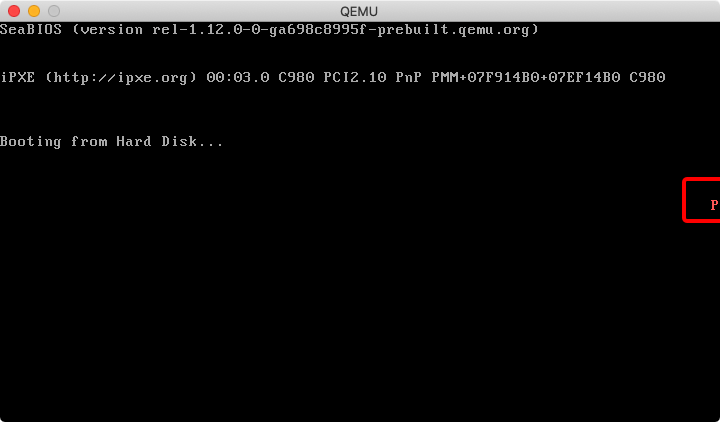
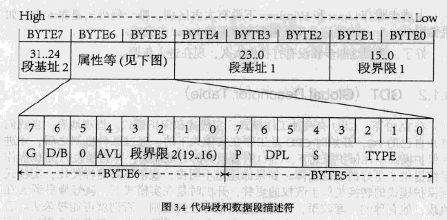
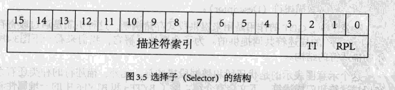
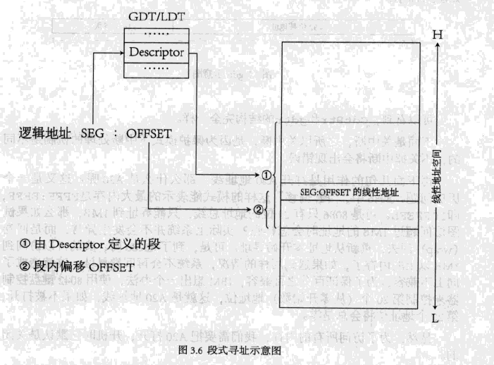
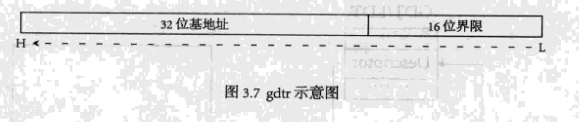

# 保护模式

## 3.1 认识保护模式

>注意，我们的 `sector` 一定要是 512 字节大小，然后以 `0xaa55` 结尾。

Descriptor 这个宏表示的不是一段代码，而是一段 `数据结构`

```asm
; 宏 ------------------------------------------------------------------------------------------------------
;
; 描述符
; usage: Descriptor Base, Limit, Attr
;        Base:  dd
;        Limit: dd (low 20 bits available)
;        Attr:  dw (lower 4 bits of higher byte are always 0)
%macro Descriptor 3
	dw	%2 & 0FFFFh									; 段界限1，引用第二个参数去掉高16位
	dw	%1 & 0FFFFh									; 段基址1，引用第一个参数去掉高16位
	db	(%1 >> 16) & 0FFh							; 段基址2，引用第一个参数，并将高16位移动到低16位，其余的位置零
	dw	((%2 >> 8) & 0F00h) | (%3 & 0F0FFh)			; 属性1 + 段界限2 + 属性2，将一个 word 的 [0,15] 和 [24, 31] 置位参数三的相同位，[16, 23] 置位为参数而的 [24, 31]
	db	(%1 >> 24) & 0FFh							; 段基址3，保留参数1的高8位
%endmacro 											; 共 8 字节
```

在接下来的代码段 `[SECTION .gdt]` 中:

`GdtLen` 是 GDT 的长度，GdtPtr 也是个小的数据结构，它有6字节，前2个字节是GDT的界限，后4字节是 GDT 的基地址。

```asm
[SECTION .gdt]
; GDT
;                              		 段基址,    段界限，			属性
LABEL_GDT:	   		Descriptor       0,         0, 					0           	; 空描述符
LABEL_DESC_CODE32:  Descriptor       0, 		SegCode32Len - 1,	DA_C + DA_32	; 非一致代码段
LABEL_DESC_VIDEO:   Descriptor 		 0B8000h,   0ffffh, 			DA_DRW	     	; 显存首地址
; GDT 结束

GdtLen		equ	$ - LABEL_GDT	; GDT长度

; 可以把 GdtPtr 当做一个数组，基地址是索引0，界限就是数组最后一位的索引。
GdtPtr		dw	GdtLen - 1		; GDT界限
			dd	0				; GDT基地址
; GDT 选择子
SelectorCode32		equ	LABEL_DESC_CODE32 - LABEL_GDT
SelectorVideo		equ	LABEL_DESC_VIDEo - LABEL_GDT
; END of [SECTION .gdt]
```

`[BITS 16]` 明确指定了它是一个16位代码段。这段程序修改了一些 GDT 中的值，然后执行了一些不常见的指令，最后通过 jmp 指令实现一个跳转。 **在这个跳转中真正的进入了保护模式**

实际上，它将跳转到第三个 section，即 `[SECTION .s32]`，这个段是32位的，执行最后一小段代码。

```asm
[SECTION .s16]
[BITS	16]
LABEL_BEGIN:
	mov	ax, cs
	mov	ds, ax
	mov	es, ax
	mov	ss, ax
	mov	sp, 0100h

	; 初始化 32 位代码段描述符
	xor	eax, eax
	mov	ax, cs
	shl	eax, 4
	add	eax, LABEL_SEG_CODE32
	mov	word [LABEL_DESC_CODE32 + 2], ax
	shr	eax, 16
	mov	byte [LABEL_DESC_CODE32 + 4], al
	mov	byte [LABEL_DESC_CODE32 + 7], ah

	; 为加载 GDTR 作准备
	xor	eax, eax
	mov	ax, ds
	shl	eax, 4
	add	eax, LABEL_GDT		; eax <- gdt 基地址
	mov	dword [GdtPtr + 2], eax	; [GdtPtr + 2] <- gdt 基地址

	; 加载 GDTR
	lgdt	[GdtPtr]

	; 关中断
	cli

	; 打开地址线A20
	in	al, 92h
	or	al, 00000010b
	out	92h, al

	; 准备切换到保护模式
	mov	eax, cr0
	or	eax, 1
	mov	cr0, eax

	; 真正进入保护模式
	jmp	dword SelectorCode32:0	; 执行这一句会把 SelectorCode32 装入 cs,
					; 并跳转到 Code32Selector:0  处
; END of [SECTION .s16]
```



在屏幕中出现一个红色的字母 “P”。程序的最后一部分代码中写入的两个字节是写进了显存的。

### 3.1.1 保护模式的运行环境

我们通过指令将 `org	07c00h` 写入了引导扇区，但是主引导扇区只有 512 字节。

### 3.1.2 GDT

**GDT 的作用是提供段式存储机制，这种机制是通过段寄存器和 GDT 中的描述符共同提供的。**

在实模式之下：

>物理地址 = segment * 16 + offset

在保护模式之下：

在实模式之下，segment 还是可以看做地址的一部分。 **而保护模式之下的 segment 概念发生了根本性的变化**，它只是一个索引，这个索引指向了 `GDT` 中的一个表项，这个表项中定义了段的起始地址、界限和属性等内容。



>对照上面的图自己实现一下了这个 `Descriptor`

1. 设置 Limit 的 [0, 15]
2. 设置 Base 的 [0, 15]
3. 设置 Base 的 [16, 23]，为什么这里需要两条指令而不是一条指令呢？因为这里是三个字节，并没有直接设置三个字节的伪指令。
4. 这条指令其实可以拆分为几条不同的指令：`db`,
	4.1 设置 Attr 的 [0, 7] 和 [12, 15]
	4.2 设置 Base 的 [16, 19]
5. 设置 Base 的 [24, 31]

**有几个**

```asm
; 宏 ------------------------------------------------------------------------------------------------------
;
; 描述符
; usage: Descriptor Base, Limit, Attr
;        Base:  dd
;        Limit: dd (low 20 bits available)
;        Attr:  dw (lower 4 bits of higher byte are always 0)
%macro Descriptor 3
	dw	%2 & 0FFFFh
	dw  %1 & 0FFFFh
	db	(%1 >> 16) & 0FFh
	dw	((%2 >> 8) & 0F00h) | (%3 & 0F0FFh)
	db	(%1 >> 24) & 0FFh
%endmacro
```

---

在本例中有三个描述符，分别是 DESC_DUMMY, DESC_CODE32 和 DESC_VIDEO，其中 DESC_VIDEO 的段地址是 `0B8000h`。这个描述符指向的就是我们的显存。

在下面的这一段代码中，`mov ax SelectorVideo` 和 `mov gs, ax` 将 `段寄存器` gs 的值编程了 SelectorVideo


```asm
[SECTION .s32]; 32 位代码段. 由实模式跳入.
[BITS	32]

LABEL_SEG_CODE32:
	mov	ax, SelectorVideo
	mov	gs, ax			; 视频段选择子(目的)

	mov	edi, (80 * 11 + 79) * 2	; 屏幕第 11 行, 第 79 列。
	mov	ah, 0Ch			; 0000: 黑底    1100: 红字
	mov	al, 'P'
	mov	[gs:edi], ax

	; 到此停止
	jmp	$
```

而 SelectorVideo 的地址是

```asm
SelectorVideo		equ	LABEL_DESC_VIDEO - LABEL_GDT
```

这里的 `LABEL_DESC_VIDEO` - `LABEL_GDT` 得到的是两个标签之间的偏移量。

直观上看它是 DESC_VIDEO 这个描述符相对于 GDT 基址的偏移。但是实际上它有一个专门的名字叫做 `Selector`，并且它也不是一个偏移，而是一个如下图所示的机构：



当 TI 和 RPL 都为零时，Selector 就变成了对应描述符相对于 GDT 基址的偏移。就好像我们的程序中一样。

那么我们可以看到 `LABEL_SEG_CODE32` 这段代码，其实就是往显存描述符的地址的 offset = edi 的地址写入了字符 `'P'`



## 一段可以执行的代码

```asm
; ==========================================
; pmtest1.asm
; 编译方法：nasm pmtest1.asm -o pmtest1.bin
; ==========================================

%include	"pm.asm"	; 常量, 宏, 以及一些说明

org	07c00h
	jmp	LABEL_BEGIN

[SECTION .gdt]
; GDT
;                              段基址,       段界限     , 属性
LABEL_GDT:	   Descriptor       0,                0, 0           ; 空描述符
LABEL_DESC_CODE32: Descriptor       0, SegCode32Len - 1, DA_C + DA_32; 非一致代码段
LABEL_DESC_VIDEO:  Descriptor 0B8000h,           0ffffh, DA_DRW	     ; 显存首地址
; GDT 结束

GdtLen		equ	$ - LABEL_GDT	; GDT长度
GdtPtr		dw	GdtLen - 1	; GDT界限
		dd	0		; GDT基地址

; GDT 选择子
SelectorCode32		equ	LABEL_DESC_CODE32	- LABEL_GDT
SelectorVideo		equ	LABEL_DESC_VIDEO	- LABEL_GDT
; END of [SECTION .gdt]

[SECTION .s16]
[BITS	16]
LABEL_BEGIN:
	mov	ax, cs
	mov	ds, ax
	mov	es, ax
	mov	ss, ax
	mov	sp, 0100h

	; 初始化 32 位代码段描述符
	xor	eax, eax
	mov	ax, cs
	shl	eax, 4
	add	eax, LABEL_SEG_CODE32
	mov	word [LABEL_DESC_CODE32 + 2], ax
	shr	eax, 16
	mov	byte [LABEL_DESC_CODE32 + 4], al
	mov	byte [LABEL_DESC_CODE32 + 7], ah

	; 为加载 GDTR 作准备
	xor	eax, eax
	mov	ax, ds
	shl	eax, 4
	add	eax, LABEL_GDT		; eax <- gdt 基地址
	mov	dword [GdtPtr + 2], eax	; [GdtPtr + 2] <- gdt 基地址

	; 加载 GDTR
	lgdt	[GdtPtr]

	; 关中断
	cli

	; 打开地址线A20
	in	al, 92h
	or	al, 00000010b
	out	92h, al

	; 准备切换到保护模式
	mov	eax, cr0
	or	eax, 1
	mov	cr0, eax

	; 真正进入保护模式
	jmp	dword SelectorCode32:0	; 执行这一句会把 SelectorCode32 装入 cs,
					; 并跳转到 Code32Selector:0  处
; END of [SECTION .s16]


[SECTION .s32]; 32 位代码段. 由实模式跳入.
[BITS	32]

LABEL_SEG_CODE32:
	mov	ax, SelectorVideo
	mov	gs, ax			; 视频段选择子(目的)

	mov	edi, (80 * 11 + 79) * 2	; 屏幕第 11 行, 第 79 列。
	mov	ah, 0Ch			; 0000: 黑底    1100: 红字
	mov	al, 'P'
	mov	[gs:edi], ax

	; 到此停止
	jmp	$

SegCode32Len	equ	$ - LABEL_SEG_CODE32
; END of [SECTION .s32]

times         361        db        0        ; 填充剩下的空间，使生成的二进制代码恰好为512字节
dw         0xaa55                                ; 结束标志
```

### 3.1.3 实模式到保护模式，不一般的 jmp

[How do AX, AH, AL map onto EAX?](https://stackoverflow.com/questions/15191178/how-do-ax-ah-al-map-onto-eax)

AX is the 16 lower bits of EAX. AH is the 8 high bits of AX (i.e. the bits 8-15 of EAX) and AL is the least significant byte (bits 0-7) of EAX as well as AX.

```
EAX: 12 34 56 78
AX: 56 78
AH: 56
AL: 78
```

#### 初始化 32 位代码段描述符

```asm
	; 初始化 32 位代码段描述符
	xor	eax, eax                                ; eax 寄存器清零
	mov	ax, cs                                  ; code segment 赋值 ax
	shl	eax, 4                                  ; CS:IP 取址等于 CS * 16 + IP，这里是 CS * 16
	add	eax, LABEL_SEG_CODE32                   ; CS * 16 + offset
	; eax 现在是程序的基地址，我们需要用这个程序的基地址来初始化我们的 GDT 的这个表项
	mov	word [LABEL_DESC_CODE32 + 2], ax        ; CS 的低16位初始化
	shr	eax, 16                                 ; CS 的高16位
	mov	byte [LABEL_DESC_CODE32 + 4], al        ; CS 的高16位的低八位
	mov	byte [LABEL_DESC_CODE32 + 7], ah        ; CS 的高16位的高八位
```

**由于 `DESC_CODE32` 的段界限和属性在初始化的时候就已经确定，所以它已经完全初始化完毕**

#### 初始化 GdtPtr

下面这一段代码比较好理解，就是计算出 `Gdt` 的地址并赋值给 `GdtPtr`


```asm
; 初始化的是这个指针
GdtPtr	dw	GdtLen - 1	; GDT界限
		dd	0		; GDT基地址

	; 为加载 GDTR 作准备
	xor	eax, eax
	mov	ax, ds
	shl	eax, 4
	add	eax, LABEL_GDT		; eax <- gdt 基地址
	mov	dword [GdtPtr + 2], eax	; [GdtPtr + 2] <- gdt 基地址
```

#### 加载 GDTR

GDTR 如下图所示：



#### 切换到保护模式

CR0 是系统内的控制寄存器之一。控制寄存器是一些特殊的寄存器，它们可以控制CPU的一些重要特性。

0位是保护允许位PE(Protedted Enable)，用于启动保护模式，如果PE位置1，则保护模式启动，如果PE=0，则在实模式下运行。

```asm
	; 准备切换到保护模式
	mov	eax, cr0
	or	eax, 1
	mov	cr0, eax
```

这个时候，我们已经进入保护模式了。但是此时 `cs` 的值仍然是实模式下的值，所以我们需要把代码段的 selector 装入 `cs`

注意，我们要注意一个重大的区别，实模式的 jmp 和保护模式的 jmp 是不一样的。

实模式的 `jmp CS:IP` 跳转的是实际物理地址。

而保护模式跳转的地址是：首先查找 GDTR 找到 GDT 表的基地址，通过基地址加上 CS 就可以找到 GDT 表中我们要跳转的表项目，再加上 IP 就得到了实际的线性地址。

```asm
	jmp	dword SelectorCode32:0	; 执行这一句会把 SelectorCode32 装入 cs,
					            ; 并跳转到 SelectorCode32:0  处
```

### 总结

进入保护模式并且在屏幕输出数字的整个流程如下所示：

#### [SECTION .gdt]

首先我们声明一个 `[SECTION .gdt]` 的 segment，注意这里 `.gdt` 是段名，但是修改它也不会影响程序运行。在这个段中，我们需要使用我们宏来 **声明** `GDT`，GDT 中的每一个表项都是我们前面提到的 `64位的特殊数据结构`。

需要注意的是，我们这里的三个表项 `LABEL_GDT`， `LABEL_DESC_CODE32`， `LABEL_DESC_VIDEO`：第一个只是空描述符， **第二个只初始化了段界限和属性，没有初始化基址**，第三个则完全初始化了。

随后，我们声明一个 `GdtPtr`，这个将会用来初始化 `GDTR`。注意，这里也只是声明了 GdtPtr，没有实际的初始化，更没有加载到 `GDTR`

计算 GDT 的表项和 GDT 的基址的偏移量作为 selector（`SelectorCode32`， `SelectorVideo`）

#### LABEL_BEGIN

1. 我们将 `LABEL_BEGIN` 的地址初始化到了 `LABEL_DESC_CODE32` 中，这是 GDT 的一个表项；
2. 将我们的 `LABEL_GDT` 的地址加载到 `GDTR` 中
3. 打开 A20 总线（由于历史原因）
4. 切换到保护模式
5. 在保护模式下，使用 `SelectorCode32` 这个偏移量加上刚才初始化的 `GDTR` 中的基址来找到我们需要执行的下一步。因为这个 selector 被我们初始化到了 `LABEL_DESC_CODE32` 这个表项，那么我们现在就在保护模式下跳转到了 `LABEL_SEG_CODE32` 这个 label

#### LABEL_SEG_CODE32

还是通过同样的寻址步骤，找到 `LABEL_DESC_VIDEO` 这个 GDT 表项。这个表项被绑定到了显卡上，于是我们可以将字符输出到显卡上。
